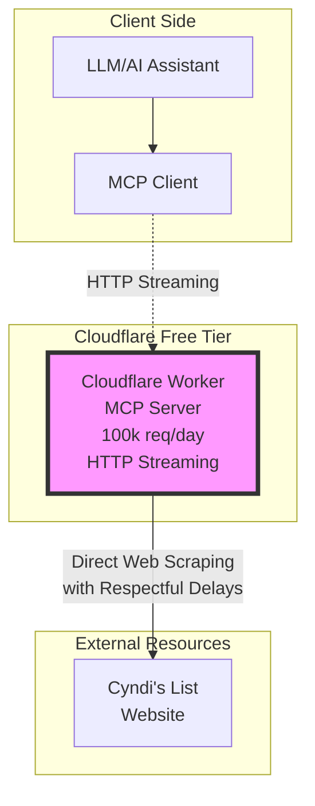

# CLG-MCP: Cyndi's List Genealogy MCP Server Architecture

This document provides detailed architectural information for the CLG-MCP server. For general usage, see [`README.md`](README.md). For deployment instructions, see [`DEPLOYMENT.md`](DEPLOYMENT.md).

## Overview

The CLG-MCP (Cyndi's List Genealogy - Model Context Protocol) server is a simplified HTTP-based MCP server hosted on Cloudflare Workers (free tier), providing genealogy resource discovery capabilities through web scraping of Cyndi's List.

**Key Design Decisions:**
- **Simplified Architecture**: No caching or KV dependencies for easier deployment
- **HTTP Streaming**: Direct HTTP transport instead of SSE for better client compatibility
- **Free Tier Optimized**: Designed to work efficiently within Cloudflare's free tier limits

## Architecture Design

### System Architecture



### Free Tier Constraints & Solutions

| Resource | Free Tier Limit | Our Strategy |
|----------|-----------------|--------------|
| Worker Requests | 100,000/day | Respectful delays, efficient request handling |
| CPU Time | 10ms per request | Efficient parsing, minimal processing |
| Workers per Account | 10 workers | Single optimized worker for all environments |
| Memory Usage | 128MB | Minimal memory footprint, no persistent state |

## Project Structure

```
clg-mcp/
├── src/
│   ├── index.ts              # Main MCP server entry point and request handler
│   ├── mcp/
│   │   ├── server.ts         # MCP server class and tool definitions
│   │   └── tools.ts          # Tool implementation handlers
│   ├── scrapers/
│   │   ├── base.ts           # Base scraper with common functionality
│   │   ├── categories.ts     # Category hierarchy scraper
│   │   ├── search.ts         # Search functionality
│   │   └── resources.ts      # Resource details scraper
│   ├── utils/
│   │   ├── auth.ts           # Authentication utilities
│   │   ├── errors.ts         # Error handling utilities
│   │   └── htmlParser.ts     # HTML parsing utilities
│   └── types/
│       └── index.ts          # TypeScript interfaces and types
├── scripts/
│   ├── deploy.ts             # Automated deployment script
│   ├── test-connection.ts    # Connection testing script
│   ├── test-auth.ts          # Authentication testing script
│   ├── test-connection.ts    # Connection testing script
│   └── diagnose-connection.ts # Connection diagnostics script
├── wrangler.toml             # Cloudflare Worker configuration
├── package.json              # Project dependencies and scripts
├── tsconfig.json             # TypeScript configuration
├── .env.example              # Environment variables template
├── example-client-config.json # MCP client configuration examples
├── README.md                 # Main documentation
├── DEPLOYMENT.md             # Detailed deployment guide
├── AUTHENTICATION.md         # Authentication setup and security
└── kilocode-setup-guide.md   # KiloCode extension setup guide
```

## MCP Tools Specification

### 1. search_genealogy_resources

Search for genealogy resources by ancestor names, locations, or keywords.

```typescript
{
  name: "search_genealogy_resources",
  description: "Search Cyndi's List for genealogy resources",
  inputSchema: {
    type: "object",
    properties: {
      query: {
        type: "string",
        description: "Search query (names, locations, keywords)"
      },
      location: {
        type: "string",
        description: "Geographic location filter (optional)"
      },
      timePeriod: {
        type: "object",
        properties: {
          start: { type: "number", description: "Start year" },
          end: { type: "number", description: "End year" }
        }
      },
      resourceType: {
        type: "string",
        enum: ["census", "vital_records", "military", "immigration", 
               "newspapers", "cemeteries", "church_records", "all"],
        description: "Type of genealogy resource"
      },
      maxResults: {
        type: "number",
        description: "Maximum results to return (default: 20, max: 50)"
      }
    },
    required: ["query"]
  }
}
```

### 2. browse_categories

Browse and navigate Cyndi's List category hierarchy.

```typescript
{
  name: "browse_categories",
  description: "Browse genealogy resource categories on Cyndi's List",
  inputSchema: {
    type: "object",
    properties: {
      parentCategory: {
        type: "string",
        description: "Parent category ID (optional, null for top-level)"
      },
      includeCount: {
        type: "boolean",
        description: "Include resource count per category"
      }
    }
  }
}
```

### 3. get_resource_details

Get detailed information about a specific genealogy resource.

```typescript
{
  name: "get_resource_details",
  description: "Get detailed information about a specific genealogy resource",
  inputSchema: {
    type: "object",
    properties: {
      resourceId: {
        type: "string",
        description: "Unique resource identifier"
      },
      includeRelated: {
        type: "boolean",
        description: "Include related resources"
      }
    },
    required: ["resourceId"]
  }
}
```

### 4. filter_resources

Filter resources by multiple criteria.

```typescript
{
  name: "filter_resources",
  description: "Filter genealogy resources by multiple criteria",
  inputSchema: {
    type: "object",
    properties: {
      categories: {
        type: "array",
        items: { type: "string" },
        description: "Category IDs to filter by"
      },
      locations: {
        type: "array",
        items: { type: "string" },
        description: "Geographic locations"
      },
      languages: {
        type: "array",
        items: { type: "string" },
        description: "Resource languages"
      },
      freeOnly: {
        type: "boolean",
        description: "Only show free resources"
      },
      hasDigitalRecords: {
        type: "boolean",
        description: "Only show resources with digital records"
      }
    }
  }
}
```

### 5. get_location_resources

Get resources specific to a geographic location.

```typescript
{
  name: "get_location_resources",
  description: "Get genealogy resources for a specific location",
  inputSchema: {
    type: "object",
    properties: {
      country: {
        type: "string",
        description: "Country name"
      },
      state: {
        type: "string",
        description: "State/Province name (optional)"
      },
      county: {
        type: "string",
        description: "County name (optional)"
      },
      city: {
        type: "string",
        description: "City name (optional)"
      }
    },
    required: ["country"]
  }
}
```

## Simplified Architecture Benefits

### No Caching Layer

The current implementation deliberately avoids caching for several reasons:

1. **Simplified Deployment**: No KV namespace setup required
2. **Reduced Complexity**: Cleaner codebase without cache management
3. **Better Compatibility**: Direct HTTP responses work with all MCP clients
4. **Easier Debugging**: No cache-related issues to troubleshoot
5. **Respectful by Design**: Built-in delays ensure responsible scraping

### Built-in Rate Limiting

Instead of KV-based rate limiting, the server uses:

```typescript
// Built-in delays for respectful scraping
const SCRAPING_DELAYS = {
  search: 1000,     // 1 second between search requests
  categories: 800,  // 800ms between category requests
  resources: 1000,  // 1 second between resource requests
  filters: 1200,    // 1.2 seconds between filter requests
};
```

## Web Scraping Strategy

### Scraping Principles

1. **Respectful Crawling**
   - User-Agent: `CLG-MCP/1.0 (Genealogy Research Tool)`
   - Respect robots.txt
   - 1-2 second delay between requests
   - Cache everything possible

2. **Target URLs**
   ```
   Base URL: https://www.cyndislist.com/
   Categories: /categories/
   Search: /search/?q={query}
   Resources: /links/{resource-id}/
   ```

3. **HTML Parsing Strategy**
   - Use Cloudflare HTMLRewriter for streaming parsing
   - Target specific CSS selectors
   - Graceful fallbacks for structure changes

### Error Handling

```typescript
class ScraperError extends Error {
  constructor(
    message: string,
    public code: string,
    public retryable: boolean = true
  ) {
    super(message);
  }
}

// Error recovery strategies
const ERROR_STRATEGIES = {
  RATE_LIMITED: { delay: 60000, retries: 3 },
  PARSE_ERROR: { delay: 0, retries: 0 },
  NETWORK_ERROR: { delay: 5000, retries: 2 },
  CACHE_ERROR: { delay: 0, retries: 1 },
};
```

## Cloudflare Deployment

### Worker Configuration (wrangler.toml)

```toml
name = "clg-mcp"
main = "src/index.ts"
compatibility_date = "2024-01-01"
workers_dev = true

[build]
command = "npm run build"

# Production environment
[env.production]
name = "clg-mcp"

[env.production.vars]
DEBUG_MODE = "false"
ENVIRONMENT = "production"
MCP_SERVER_NAME = "clg-mcp"
MCP_SERVER_VERSION = "1.0.0"
REQUEST_TIMEOUT = "30000"
MAX_SEARCH_RESULTS = "50"
MCP_PROTOCOL_VERSION = "2024-11-05"

# Development environment
[env.development]
name = "clg-mcp-dev"
```

See [`wrangler.toml`](wrangler.toml) for the complete configuration.

### Environment Variables

```bash
# Authentication (optional)
MCP_AUTH_TOKEN=your_secret_token
MCP_AUTH_TOKENS=token1,token2,token3

# Optional configuration
DEBUG_MODE=false
REQUEST_TIMEOUT=30000
MAX_SEARCH_RESULTS=50
```

See [`.env.example`](.env.example) for complete environment variable documentation.

### Deployment Steps

1. **Automated Deployment (Recommended)**
   ```bash
   npm run setup
   wrangler login
   npm run deploy:full
   ```

2. **Manual Deployment**
   ```bash
   npm install
   npm run build
   npm run deploy
   ```

3. **Test Deployment**
   ```bash
   npm run test:connection
   ```

For detailed deployment instructions, see [`DEPLOYMENT.md`](DEPLOYMENT.md).

## Performance Optimizations

### Request Optimization

1. **Request Coalescing**: Combine multiple similar requests
2. **Partial Responses**: Return available cache data immediately
3. **Progressive Enhancement**: Basic data first, details on demand

### Data Optimization

1. **Minimize Payload Size**
   ```typescript
   // Return only essential fields
   interface MinimalResource {
     id: string;
     title: string;
     url: string;
     category: string;
     // Extended data available via get_resource_details
   }
   ```

2. **Lazy Loading**: Load detailed information only when requested

### Monitoring & Analytics

```typescript
// Track usage to stay within limits
async function trackUsage(env: Env, metric: string) {
  const date = new Date().toISOString().split('T')[0];
  const key = `stats:${date}:${metric}`;
  
  try {
    const current = await env.CACHE.get(key) || '0';
    if (parseInt(current) < 1000) { // Prevent stats from consuming write quota
      await env.CACHE.put(key, String(parseInt(current) + 1), {
        expirationTtl: 7 * 24 * 60 * 60 // 7 days
      });
    }
  } catch (error) {
    // Ignore stats errors
  }
}
```

## Challenges & Mitigations

### 1. Free Tier Limits

**Challenge**: 100k requests/day, 10ms CPU time per request
**Mitigation**:
- Efficient request processing
- Built-in delays for respectful scraping
- Optimized HTML parsing

### 2. Website Structure Changes

**Challenge**: Cyndi's List HTML changes
**Mitigation**:
- Multiple selector strategies
- Graceful degradation
- Version detection

### 3. Performance Constraints

**Challenge**: 10ms CPU time limit
**Mitigation**:
- Streaming HTML parsing
- Minimal data processing
- Pre-computed cache keys

### 4. Search Functionality

**Challenge**: Limited search capabilities from external website
**Mitigation**:
- Use Cyndi's List search directly
- Implement query normalization
- Provide efficient result filtering

## Future Enhancements

1. **Performance Optimizations**:
   - Add intelligent caching layer when needed
   - Implement request batching
   - Optimize scraping patterns

2. **Feature Additions**:
   - Enhanced search filters
   - Resource recommendations
   - Search result ranking

3. **Integration Options**:
   - FamilySearch API integration
   - Ancestry.com public records
   - FindAGrave connections

4. **Upgrade Path**: When ready for paid tier
   - Add Durable Objects for advanced features
   - Implement R2 for data storage
   - Enhanced monitoring and analytics

## Conclusion

This simplified architecture provides a robust, easy-to-deploy MCP server for genealogy resource discovery while staying within Cloudflare's free tier limits. The elimination of caching complexity makes it much easier to deploy and maintain.

Key benefits:
- **Zero infrastructure cost** - Uses Cloudflare's free tier
- **Global edge deployment** - Fast response times worldwide
- **Automatic scaling** - Handles traffic spikes automatically
- **No server maintenance** - Serverless architecture
- **Simple deployment** - No KV namespace setup required
- **Better compatibility** - HTTP transport works with all MCP clients

The design is production-ready and can serve genealogy researchers daily within the free tier limits, with a clear upgrade path when more advanced features are needed.

## Related Documentation

- **[README.md](README.md)** - General project overview and setup
- **[DEPLOYMENT.md](DEPLOYMENT.md)** - Complete deployment guide
- **[AUTHENTICATION.md](AUTHENTICATION.md)** - Security and authentication setup
- **[example-client-config.json](example-client-config.json)** - Client configuration examples